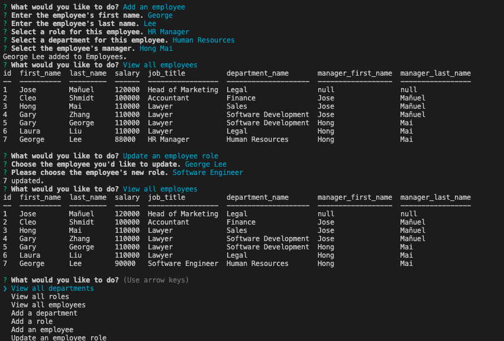

# Excellent Employee Tracker

## Description
A command-line application to manage a company's employee database, using Node.js, Inquirer, and MySQL.
## Table of Contents
1. [Installation](#installation) 
2. [Usage](#usage)
3. [Contributing](#contributing)
4. [Tests](#tests)
5. [User Story](#user_Story)
6. [Video Link](#video-link)
7. [ScreenShots](#screenshots)

## Installation 
1. Download Node.js
2. Download MYSQL
3. Run Source for SCHEMA and SEEDS .SQL files
4. Run "node index.js" in command line to initiate application

## Usage 
Developers frequently have to create interfaces that allow non-developers to easily view and interact with information stored in databases. These interfaces are called **content management systems (CMS)**. This is a command-line application built from scratch to manage a company's employee database, using Node.js, Inquirer, and MySQL.
## Contributing 
Chandra Holt

### GitHub
[GitHub](https://www.github.com/chandrapanda) 
### Email
chandra_holt@hotmail.com
## License 
  [](https://opensource.org/licenses/MPL-2.0)
  [This application is licensed under Mozilla](https://opensource.org/licenses/MPL-2.0)

## User_Story

```md
AS A business owner
I WANT to be able to view and manage the departments, roles, and employees in my company
SO THAT I can organize and plan my business
```

## Acceptance Criteria

```md
GIVEN a command-line application that accepts user input
WHEN I start the application
THEN I am presented with the following options: view all departments, view all roles, view all employees, add a department, add a role, add an employee, and update an employee role
WHEN I choose to view all departments
THEN I am presented with a formatted table showing department names and department ids
WHEN I choose to view all roles
THEN I am presented with the job title, role id, the department that role belongs to, and the salary for that role
WHEN I choose to view all employees
THEN I am presented with a formatted table showing employee data, including employee ids, first names, last names, job titles, departments, salaries, and managers that the employees report to
WHEN I choose to add a department
THEN I am prompted to enter the name of the department and that department is added to the database
WHEN I choose to add a role
THEN I am prompted to enter the name, salary, and department for the role and that role is added to the database
WHEN I choose to add an employee
THEN I am prompted to enter the employee’s first name, last name, role, and manager, and that employee is added to the database
WHEN I choose to update an employee role
THEN I am prompted to select an employee to update and their new role and this information is updated in the database 
```

## Video-Link
[Video](https://watch.screencastify.com/v/F6vhRRQP7z799NqJm51j)

## Screenshots


